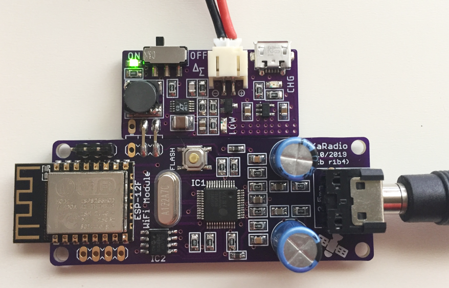

## Power Supply For WiFi WebRadio

This is a miniature power supply with built-in Li-Ion charger for [WiFi WebRadio](https://github.com/dsaltas/WiFi-WebRadio).

It is based on [LTC3440](https://www.analog.com/en/products/ltc3440.html) chip. A Micropower Synchronous Buck-Boost DC/DC Converter.

### Features

- Voltage input 2,7V to 4,2V
- Voltage output 3,3V at 600mA
- Low battery LED indicator at 3V or less
- Li-Ion charger at 4,2V / 500mA

### ToDo

- Upload gerber files
- Upload BOM
